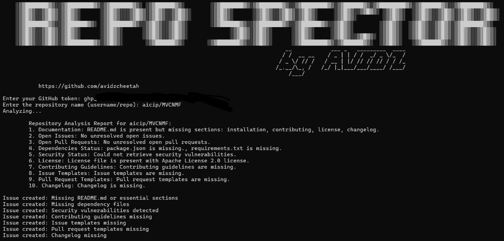

# RepoSpector

RepoSpector is a powerful GitHub repository analysis tool designed to evaluate repositories based on key aspects such as documentation quality, unresolved issues, pull requests, dependencies, security, and more. It automates the process of analyzing repositories and provides actionable insights, helping maintainers and contributors improve their codebases.


## Features

### 1. Repository Documentation
- Verifies the presence of essential files such as `README.md`, `LICENSE`, and `CHANGELOG.md`.
- Evaluates the content of `README.md` for key sections:
  - Installation instructions
  - Usage guidelines
  - Contribution guidelines
  - License information
  - Changelog details

### 2. Issue Analysis
- Fetches all open issues from the repository.
- Identifies unresolved or inactive issues based on activity and timestamps.

### 3. Pull Request Analysis
- Fetches open pull requests (PRs).
- Highlights unaddressed or stalled PRs.

### 4. Dependency Check
- Verifies the presence of manifest files (`package.json`, `requirements.txt`, etc.).
- Flags missing or outdated dependencies.

### 5. Security Alerts
- Analyzes reported vulnerabilities in the repository.
- Flags critical security issues.

### 6. License Check
- Checks for the presence of a `LICENSE` file.

### 7. Contributing Guidelines
- Verifies if a `CONTRIBUTING.md` file is available for developers.

### 8. Issue and PR Templates
- Ensures that standardized issue and pull request templates are present in the repository.

### 9. Changelog Verification
- Confirms the presence of a `CHANGELOG.md` file to track project updates.

### 10. Automated Reporting
- Generates a comprehensive report summarizing the repository analysis.
- Automatically creates GitHub issues for critical problems, such as missing documentation or vulnerabilities.

---

## Installation

1. Clone this repository:
   ```bash
   git clone https://github.com/your-username/RepoSpector.git
   ```

2. Navigate to the project directory:
   ```bash
   cd RepoSpector
   ```

3. Install the required Python packages:
   ```bash
   pip install -r requirements.txt
   ```

---

## Usage

1. Set up your GitHub Personal Access Token:
   - Create a token with appropriate permissions from your [GitHub Developer Settings](https://github.com/settings/tokens).

2. Run RepoSpector:
   ```bash
   python RepoSpector.py
   ```

3. View the generated report in the terminal or check the newly created GitHub issues for flagged problems.

---

## Example

```bash
python RepoSpector.py
```

Sample Output:
```
Analyzing repository: octocat/Hello-World
--------------------------------------------------
✅ README.md is present and contains essential sections.
❌ LICENSE file is missing.
❌ SECURITY vulnerabilities found (2 critical issues).
✅ CONTRIBUTING.md is present.
...
Report generated successfully!
```

---

## Roadmap
- Enhance dependency analysis to check for outdated libraries via APIs (e.g., npm, PyPI).
- Add support for additional repository platforms (e.g., GitLab, Bitbucket).
- Improve reporting with a web-based dashboard.

---

## Contributing

Contributions are welcome! To get started:
1. Fork this repository.
2. Create a new branch (`git checkout -b feature-branch-name`).
3. Make your changes and commit them (`git commit -m 'Add feature XYZ'`).
4. Push to your fork (`git push origin feature-branch-name`).
5. Open a Pull Request.

---

## License

This project is open for anyone to make changes and develop.

---

## Contact

Created by [Avidu Witharana](https://github.com/avidzcheetah). Feel free to reach out via email or GitHub for questions and suggestions!
